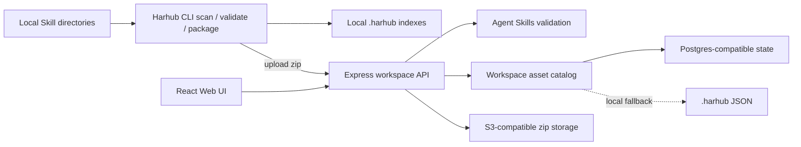
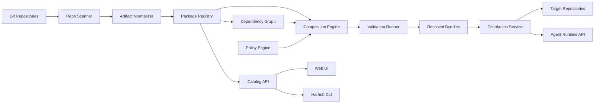

# 架构

## 概览

Harhub 是 agent harnesses 的控制平面。当前 MVP 有两条输入路径：CLI 扫描本地目录；Web 或 CLI 将标准 Agent Skill 目录打包成 zip，再上传到 workspace。服务端不再扫描本地文件路径，也尚未接入 Git provider。Uploaded Skills 按 agentskills.io 校验，并保存管理所需的运行态记录。

> 状态说明：本章同时记录当前 beta 的实际拓扑和长期目标架构。Repository Scanner、Artifact Normalizer、Dependency Graph、Composition Engine、Policy Engine、Distribution Service 和独立 worker 仍是规划能力。

系统应将 source ownership 与 harness distribution 分离：

- **Source of truth**：Git repositories、uploaded Skill packages 和 reviewed changes。
- **Control plane**：catalog、dependency graph、policy、validation、composition 和 rollout。
- **Consumers**：repositories、agents、CLI、IDE、CI 系统和 platform dashboards。

## 当前 MVP 拓扑



生产构建由一个 Express 进程提供 Web UI、API 和 `/docs/`。开发环境中，Vite Web server 使用 `5176`，API 使用 `3310`，文档站按需单独运行在 `5177`。

## 目标高层架构

下面是长期目标，不是当前部署中已经存在的服务拆分：



## 核心服务

除 Package Registry、Catalog API、Skill validation 和 object storage 的 MVP 子集外，本节服务均为目标设计。

### 仓库扫描器（Repository Scanner）

职责：

- 连接 Git providers 或 local repositories。
- 查找 Agent Skills 和已知外部 harness files。
- 追踪 commit、branch、path、author 和 review provenance。
- 检测文件移动、删除和 drift。

Scanner inputs：

- Repository allowlists。
- File discovery patterns。
- Branch policies。
- Manifest locations。

Scanner outputs：

- Raw artifact records。
- Candidate package suggestions。
- Drift findings。

### Artifact 规范化器（Artifact Normalizer）

职责：

- 将异构文件转换成 typed internal model。
- 从官方 frontmatter、headings 和 file paths 中提取可索引信息。
- 将 artifacts 分类为 rules、Skills、MCP definitions、templates 或 validation assets。
- 计算 content fingerprints 和 semantic similarity signals。

Normalizer 应保留原始内容，并避免有损转换。Normalized data 支持搜索、比较和组合，但 source file 仍是权威来源。

### Package Registry

职责：

- 存储 asset runtime state 和不可变 uploaded versions。
- 存储 source content references。
- 追踪 lifecycle states：experimental、stable、deprecated、archived。
- 追踪 owners、reviewers、consumers 和 compatibility。

Registry 不只是 blob storage。它理解外部资产的运行态、校验结果和 release state。

当前 hosted runtime registry 使用云原生持久化：

- `harhub_state` 保存 accounts、sessions、workspaces 和 memberships。
- `harhub_workspace_catalogs` 保存每个 workspace 的 Skill catalog 和 Asset catalog。
- Uploaded Skill zip bytes 存储在 S3/S3-compatible object storage，不进入数据库。
- 当未配置 `HARHUB_DATABASE_URL` 时，本地 `.harhub` JSON 文件仅作为 self-host demo 和开发 fallback。

### Catalog API

职责：

- 搜索 packages 和 artifacts。
- 提供 package details、docs、dependencies、validation reports 和 usage。
- 基于 repo characteristics 和 org policy 提供 recommendations。
- 向 UI、CLI 和 automation 暴露数据。

### 依赖图（Dependency Graph）

职责：

- 建模 package dependencies 和 consumers。
- 展示哪些 repos、teams、bundles 和 profiles 依赖每个 package version。
- 在 upgrades 或 deprecations 前支持 impact analysis。
- 检测 cycles 和 incompatible version constraints。

### 组合引擎（Composition Engine）

职责：

- 解析 package version constraints。
- 应用 package layers 和 precedence。
- 合并兼容 artifacts。
- 检测 conflicts、duplicates、missing dependencies 和 policy violations。
- 输出 resolved bundles 和运行态分发记录。

Composition 应生成 explanation trace，让用户看到每个 artifact 为什么出现在最终 bundle 中。

### 策略引擎（Policy Engine）

职责：

- 执行 review requirements。
- 按风险对 MCP servers 和 Skills 分类。
- 执行允许和禁止的 tool scopes。
- 管理带 expiry 和 owner 的 exceptions。
- 防止 secrets 等 forbidden content。

Policy engine 应在 package publish time、composition time 和 distribution time 运行。

### 校验执行器（Validation Runner）

职责：

- 校验 Agent Skills 以及已知外部格式的结构。
- 校验 MCP definitions 和 required environment variables。
- 运行 static policy checks。
- 运行 composition checks。
- 运行可选 agent behavior evaluations。

Validation reports 应与 package versions 和 bundle resolutions 一起存储。

### 分发服务（Distribution Service）

职责：

- 将 generated files materialize 到 repositories。
- 为 harness upgrades 打开 pull requests。
- 响应 runtime bundle API requests。
- 发布运行态分发记录。
- 汇报 distribution status 和 errors。

Distribution 应支持 reference mode、materialized mode 和 hybrid mode。

## 数据模型

### SkillAsset（Skill 资产）

Agent Skills 资产直接遵循 agentskills.io 的目录与 `SKILL.md` 规范。Harhub 只保存管理运行所需数据，不定义新的 Skill schema。

字段：

- `id`
- `name`
- `displayName`
- `slug`
- `description`
- `health`
- `storage`
- `validation`
- `validationIssues`

### Bundle（组合目标）

已解析的 composition target。

字段：

- `id`
- `targetType`
- `targetRef`
- `profile`
- `createdBy`
- `createdAt`

目标类型：

- `organization`
- `team`
- `repository`
- `workflow`
- `agent`

### BundleResolution（组合结果）

不可变的 resolved bundle output。

字段：

- `id`
- `bundleId`
- `lockHash`
- `inputPackages`
- `resolvedArtifacts`
- `conflictDecisions`
- `policyExceptions`
- `validationStatus`
- `createdAt`

### Assignment（分配关系）

将 bundle 连接到 consumer。

字段：

- `id`
- `bundleId`
- `consumerType`
- `consumerRef`
- `mode`
- `status`
- `lastSyncedAt`

### Finding（发现项）

检测到的问题或建议。

字段：

- `id`
- `kind`
- `severity`
- `targetType`
- `targetRef`
- `message`
- `evidence`
- `status`
- `createdAt`

Finding 类型：

- `duplicate`
- `conflict`
- `policy-violation`
- `drift`
- `deprecated-dependency`
- `validation-failure`
- `missing-owner`

## 组合算法

默认 composition flow：

1. 加载 target profile 和 assigned packages。
2. 将 version constraints 解析为精确 package versions。
3. 展开 dependencies。
4. 按 layer 和 precedence 排序 packages。
5. 将 artifacts 规范化为 merge groups。
6. 检测 duplicates 和 semantic similarity。
7. 应用 merge strategies。
8. 检测 conflicts 和 unresolved decisions。
9. 运行 policy checks。
10. 输出 resolved bundle 和运行态分发记录。
11. 运行 validation。

Merge strategies 应感知 artifact type。

Rule merge strategies：

- `append-section`：在带 package 标签的 sections 下追加内容。
- `replace-section`：替换较低优先级 package 中的命名 section。
- `require-explicit-choice`：composition 失败，直到 maintainer 做出选择。
- `non-mergeable`：只能有一个 artifact 获胜。

Skill merge strategies：

- `include`：将 Skill 作为独立 capability 包含进来。
- `alias`：标记为等价于另一个 Skill。
- `supersede`：替换较低优先级 Skill。

MCP merge strategies：

- `union-tools`：在 policy 允许时合并 allowed tools。
- `restrictive-intersection`：只保留所有适用 policies 都允许的 tools。
- `non-mergeable`：需要显式 approval。

## 分发记录

Harhub 不在当前产品中定义任何新的 Skill 标准或用户必须采用的文件格式。需要复现或审计分发时，应保存普通运行态记录：

- source asset id。
- source version 或 uploaded object version。
- target workspace、target repo 或 target runtime。
- resolved files 的 content hash。
- validation status 和 approval event。

这些字段属于 Harhub 的运行记录，不会写回 Agent Skills 包，也不会要求用户采用新的文件格式。

## 存储

推荐初始存储：

- Relational database，用于 assets、versions、assignments、findings、audit events 和 policy state。
- Object storage 或 Git-backed blob references，用于 uploaded package snapshots。
- Search index，用于 asset catalog queries 和 semantic discovery。
- Graph representation，用于 dependencies 和 consumers。初期可放在 relational database 中，必要时再迁移到 graph-optimized store。

## API 表面

### 当前 Web API

当前 API 以 workspace 为租户边界，主要包括：

- `/api/auth/*`：密码、邮件验证码、Google/GitHub OAuth、logout 和认证能力配置。
- `/api/account`：profile 和 password mutation。
- `/api/workspaces`：workspace 创建、重命名和当前账号可访问列表。
- `/api/workspaces/{workspaceId}/members`：成员、角色和 invitations。
- `/api/workspaces/{workspaceId}/assets`：列表、详情、preview、upload、validate、bulk validate/delete 和 delete。
- `/api/workspaces/{workspaceId}/assets/{query}/share`：创建、读取和撤销公开分享。
- `/api/public/shares/{token}`：无需登录的分享元数据与 zip download。
- `/api/workspaces/{workspaceId}/skills`：Skills-only compatibility view、validate 和 delete。
- `/api/skills`：只面向 demo workspace 的 legacy read compatibility route。

完整实现快照见 [SaaS MVP](./07-saas-mvp.md#api-形态)。

### 目标 Web API

以下资源属于长期 package、composition 和 governance 设计，当前尚未实现：

核心资源：

- `/packages`
- `/packages/{name}/versions`
- `/artifacts`
- `/bundles`
- `/bundles/{id}/resolve`
- `/repositories/{id}/harness`
- `/findings`
- `/policies`

### 当前 CLI

CLI 当前支持本地 `skills`/`assets` scan、validate、list、show、create 和 update；支持将本地 Skill 目录打包上传、用 `--share` 立即创建公开链接、对已有 asset 执行 share/unshare，以及用 `harhub install` 将公开 zip 下载到当前目录。它也支持对 workspace 中已上传的 Skill 执行 revalidate 和 delete。服务端不会接收或扫描客户端本地路径。

Uploaded workspace packages 不支持原地修改；修改本地 Skill 后需要重新上传。

### 目标 CLI

长期预期命令：

```text
harhub scan
harhub package validate
harhub package publish
harhub bundle resolve
harhub bundle diff
harhub sync
harhub findings
```

### Runtime API（规划）

供 agents 或 local wrappers 使用。

能力：

- 按 repo、profile 或 lock hash 获取 resolved bundle。
- 获取 materialized files。
- 获取 allowed MCP tool config。
- 上报 harness usage 和 validation outcomes。

## 安全架构

安全需求：

- Harness packages 不得包含 secrets。
- MCP definitions 必须声明 required environment variables，但不能存储值。
- MCP tools 应带 risk labels 和 allowed scopes。
- 高风险权限需要 review。
- 每个 release、approval、assignment 和 distribution event 都应可审计。
- Runtime bundle retrieval 应按 org、team、repo 和 agent identity 授权。
- Policy exceptions 应包含 owner、reason 和 expiry。

## 部署模型

### 当前部署

当前生产构建是单一 Node.js/Express 服务：

- 提供 workspace API、React Web UI 和 VitePress docs。
- 设置 `HARHUB_DATABASE_URL` 后，将账号、sessions、workspaces、memberships、invitations、OAuth state 和 workspace asset catalog 持久化到 Postgres-compatible database。
- Uploaded Skill zip 存储在 S3-compatible object store。
- 未设置 database URL 时，使用 `.harhub` JSON fallback。
- 仓库包含 multi-stage `Dockerfile`，GitHub Actions 可构建并发布 `rockchin/harhub` image。

多个 API replicas 可以连接同一 database 和 bucket，但当前 catalog 仍以 JSONB document 存储，尚未具备独立 migration runner、normalized reporting tables、background workers 或 distributed coordination。

### 目标部署

规模扩大后的目标 deployment 可以是 stateless Web/API service 加 managed storage：

- Web/API service。
- 用于 scanning、validation、composition 和 distribution 的 worker process。
- Managed Postgres-compatible database。
- S3-compatible object store 或 content snapshot store。
- Search index。

如果规模需要，后续可以拆分为独立服务。

## 集成点

规划中的集成：

- GitHub 或 Git provider API，用于 scanning、commits 和 pull requests。
- CI systems，用于 validation checks。
- 通过运行态分发记录和 runtime API 集成 Agent CLIs 与 IDE extensions。
- MCP server catalogs 和内部 security tooling。
- 企业部署中的 SSO/RBAC provider。
