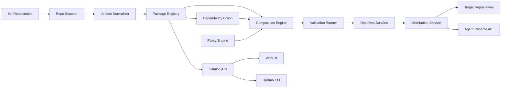

# 架构

## 概览

Harhub 是 agent harnesses 的控制平面。它从 Git 索引 source artifacts，将它们规范化为通用模型，以 packages 形式版本化，把 packages 组合为 bundles，校验结果，并将 bundles 分发到仓库和 agent runtimes。

系统应将 source ownership 与 harness distribution 分离：

- **Source of truth**：Git repositories、package manifests 和 reviewed changes。
- **Control plane**：catalog、dependency graph、policy、validation、composition 和 rollout。
- **Consumers**：repositories、agents、CLI、IDE、CI 系统和 platform dashboards。

## 高层架构



## 核心服务

### 仓库扫描器（Repository Scanner）

职责：

- 连接 Git providers 或 local repositories。
- 查找已知 harness files 和 package manifests。
- 追踪 commit、branch、path、author 和 review provenance。
- 检测文件移动、删除和 drift。

Scanner inputs：

- Repository allowlists。
- File discovery patterns。
- Branch policies。
- Manifest locations。

Scanner outputs：

- Raw artifact records。
- Candidate package suggestions。
- Drift findings。

### Artifact 规范化器（Artifact Normalizer）

职责：

- 将异构文件转换成 typed internal model。
- 从 manifests、front matter、headings 和 file paths 中提取 metadata。
- 将 artifacts 分类为 rules、Skills、MCP definitions、templates 或 validation assets。
- 计算 content fingerprints 和 semantic similarity signals。

Normalizer 应保留原始内容，并避免有损转换。Normalized data 支持搜索、比较和组合，但 source file 仍是权威来源。

### Package Registry

职责：

- 存储 package metadata 和不可变 released versions。
- 存储 artifact metadata 以及 source content references。
- 追踪 lifecycle states：experimental、stable、deprecated、archived。
- 追踪 owners、reviewers、consumers 和 compatibility。

Registry 不只是 blob storage。它理解 harness-specific package metadata 和 release state。

### Catalog API

职责：

- 搜索 packages 和 artifacts。
- 提供 package details、docs、dependencies、validation reports 和 usage。
- 基于 repo characteristics 和 org policy 提供 recommendations。
- 向 UI、CLI 和 automation 暴露数据。

### 依赖图（Dependency Graph）

职责：

- 建模 package dependencies 和 consumers。
- 展示哪些 repos、teams、bundles 和 profiles 依赖每个 package version。
- 在 upgrades 或 deprecations 前支持 impact analysis。
- 检测 cycles 和 incompatible version constraints。

### 组合引擎（Composition Engine）

职责：

- 解析 package version constraints。
- 应用 package layers 和 precedence。
- 合并兼容 artifacts。
- 检测 conflicts、duplicates、missing dependencies 和 policy violations。
- 输出 resolved bundles 和 lockfiles。

Composition 应生成 explanation trace，让用户看到每个 artifact 为什么出现在最终 bundle 中。

### 策略引擎（Policy Engine）

职责：

- 执行 review requirements。
- 按风险对 MCP servers 和 Skills 分类。
- 执行允许和禁止的 tool scopes。
- 管理带 expiry 和 owner 的 exceptions。
- 防止 secrets 等 forbidden content。

Policy engine 应在 package publish time、composition time 和 distribution time 运行。

### 校验执行器（Validation Runner）

职责：

- 校验 package structure 和 manifests。
- 校验 MCP definitions 和 required environment variables。
- 运行 static policy checks。
- 运行 composition checks。
- 运行可选 agent behavior evaluations。

Validation reports 应与 package versions 和 bundle resolutions 一起存储。

### 分发服务（Distribution Service）

职责：

- 将 generated files materialize 到 repositories。
- 为 harness upgrades 打开 pull requests。
- 响应 runtime bundle API requests。
- 发布 lockfiles。
- 汇报 distribution status 和 errors。

Distribution 应支持 reference mode、materialized mode 和 hybrid mode。

## 数据模型

### HarnessPackage（Harness 包）

可复用 harness 内容的命名、归属、版本化单元。

字段：

- `id`
- `name`
- `owner`
- `description`
- `tags`
- `lifecycleState`
- `createdAt`
- `updatedAt`

### PackageVersion（包版本）

Package 的不可变 released version。

字段：

- `id`
- `packageId`
- `version`
- `sourceRepo`
- `sourceCommit`
- `manifestPath`
- `releaseNotes`
- `validationStatus`
- `createdAt`

### Artifact（资产项）

Package version 内部的 typed item。

字段：

- `id`
- `packageVersionId`
- `type`
- `path`
- `contentHash`
- `sourceUri`
- `mergeStrategy`
- `risk`
- `metadata`

Artifact types：

- `rule`
- `skill`
- `mcp`
- `template`
- `validation`
- `runtime-config`

### Bundle（组合目标）

已解析的 composition target。

字段：

- `id`
- `targetType`
- `targetRef`
- `profile`
- `createdBy`
- `createdAt`

目标类型：

- `organization`
- `team`
- `repository`
- `workflow`
- `agent`

### BundleResolution（组合结果）

不可变的 resolved bundle output。

字段：

- `id`
- `bundleId`
- `lockHash`
- `inputPackages`
- `resolvedArtifacts`
- `conflictDecisions`
- `policyExceptions`
- `validationStatus`
- `createdAt`

### Assignment（分配关系）

将 bundle 连接到 consumer。

字段：

- `id`
- `bundleId`
- `consumerType`
- `consumerRef`
- `mode`
- `status`
- `lastSyncedAt`

### Finding（发现项）

检测到的问题或建议。

字段：

- `id`
- `kind`
- `severity`
- `targetType`
- `targetRef`
- `message`
- `evidence`
- `status`
- `createdAt`

Finding 类型：

- `duplicate`
- `conflict`
- `policy-violation`
- `drift`
- `deprecated-dependency`
- `validation-failure`
- `missing-owner`

## 组合算法

默认 composition flow：

1. 加载 target profile 和 assigned packages。
2. 将 version constraints 解析为精确 package versions。
3. 展开 dependencies。
4. 按 layer 和 precedence 排序 packages。
5. 将 artifacts 规范化为 merge groups。
6. 检测 duplicates 和 semantic similarity。
7. 应用 merge strategies。
8. 检测 conflicts 和 unresolved decisions。
9. 运行 policy checks。
10. 输出 resolved bundle 和 lockfile。
11. 运行 validation。

Merge strategies 应感知 artifact type。

Rule merge strategies：

- `append-section`：在带 package 标签的 sections 下追加内容。
- `replace-section`：替换较低优先级 package 中的命名 section。
- `require-explicit-choice`：composition 失败，直到 maintainer 做出选择。
- `non-mergeable`：只能有一个 artifact 获胜。

Skill merge strategies：

- `include`：将 Skill 作为独立 capability 包含进来。
- `alias`：标记为等价于另一个 Skill。
- `supersede`：替换较低优先级 Skill。

MCP merge strategies：

- `union-tools`：在 policy 允许时合并 allowed tools。
- `restrictive-intersection`：只保留所有适用 policies 都允许的 tools。
- `non-mergeable`：需要显式 approval。

## Lockfile（锁文件）

Resolved bundle 应生成 lockfile，让 consumers 能复现精确 harness。

示例：

```yaml
apiVersion: harhub.io/v1
kind: HarnessLock
metadata:
  target: repo:payments/web-checkout
  profile: frontend-react
spec:
  resolvedAt: 2026-06-28T00:00:00Z
  lockHash: sha256:example
  packages:
    - name: org-security-baseline
      version: 1.2.3
      sourceCommit: abc123
    - name: frontend-react-standard
      version: 1.0.0
      sourceCommit: def456
  outputs:
    - path: AGENTS.md
      contentHash: sha256:agents
    - path: DESIGN.md
      contentHash: sha256:design
  policy:
    exceptions: []
```

## 存储

推荐初始存储：

- Relational database，用于 packages、versions、assignments、findings、audit events 和 policy state。
- Object storage 或 Git-backed blob references，用于 artifact content snapshots。
- Search index，用于 catalog queries 和 semantic artifact discovery。
- Graph representation，用于 dependencies 和 consumers。初期可放在 relational database 中，必要时再迁移到 graph-optimized store。

## API 表面

### Web API

供 UI 和 integrations 使用。

核心资源：

- `/packages`
- `/packages/{name}/versions`
- `/artifacts`
- `/bundles`
- `/bundles/{id}/resolve`
- `/repositories/{id}/harness`
- `/findings`
- `/policies`

### CLI

预期命令：

```text
harhub scan
harhub package validate
harhub package publish
harhub bundle resolve
harhub bundle diff
harhub sync
harhub findings
```

### Runtime API

供 agents 或 local wrappers 使用。

能力：

- 按 repo、profile 或 lock hash 获取 resolved bundle。
- 获取 materialized files。
- 获取 allowed MCP tool config。
- 上报 harness usage 和 validation outcomes。

## 安全架构

安全需求：

- Harness packages 不得包含 secrets。
- MCP definitions 必须声明 required environment variables，但不能存储值。
- MCP tools 应带 risk labels 和 allowed scopes。
- 高风险权限需要 review。
- 每个 release、approval、assignment 和 distribution event 都应可审计。
- Runtime bundle retrieval 应按 org、team、repo 和 agent identity 授权。
- Policy exceptions 应包含 owner、reason 和 expiry。

## 部署模型

MVP deployment 可以是带 background workers 的单体服务：

- Web/API service。
- 用于 scanning、validation、composition 和 distribution 的 worker process。
- Database。
- Object store 或 content snapshot store。
- Search index。

如果规模需要，后续可以拆分为独立服务。

## 集成点

初始集成：

- GitHub 或 Git provider API，用于 scanning、commits 和 pull requests。
- CI systems，用于 validation checks。
- 通过 lockfiles 和 runtime API 集成 Agent CLIs 与 IDE extensions。
- MCP server catalogs 和内部 security tooling。
- 企业部署中的 SSO/RBAC provider。
