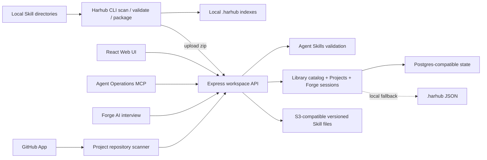
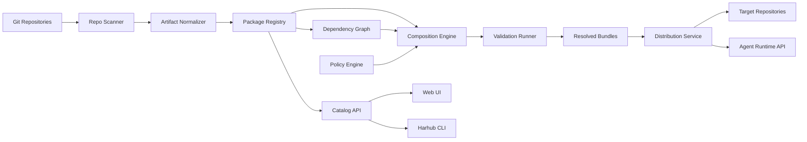

# 架构

## 概览

Harhub 是 agent harnesses 的控制平面。当前实现有三条主要输入路径：

- CLI 扫描本地目录，Web、CLI 或 MCP 将标准 Agent Skill 包上传到 workspace Library。
- Forge 根据需求和 workspace Skills 生成 project harness，并将完成的 session freeze 为 Project。
- GitHub App 导入 existing repository，由服务端扫描 repository Skills、MCP 配置、rules 和 agent instructions；GitHub Action sync 是另一种 Project 接入路径。

> 状态说明：本章同时记录当前 beta 的实际拓扑和长期目标架构。Repository Scanner 与早期 Artifact classification 已在 Project scope 内实现；Dependency Graph、通用 Composition Engine、Policy Engine、跨工具 Distribution Service 和独立 worker 仍是规划能力。

系统应将 source ownership 与 harness distribution 分离：

- **Source of truth**：Git repositories、uploaded Skill packages 和 reviewed changes。
- **Control plane**：catalog、dependency graph、policy、validation、composition 和 rollout。
- **Consumers**：repositories、agents、CLI、IDE、CI 系统和 platform dashboards。

## 当前 MVP 拓扑


```mermaid
flowchart LR
  Local["Local Skill directories"] --> CLI["Harhub CLI scan / validate / package"]
  CLI --> LocalIndex["Local .harhub indexes"]
  CLI -- "upload zip" --> API["Express workspace API"]
  Web["React Web UI"] --> API
  MCP["Agent Operations MCP"] --> API
  Forge["Forge AI interview"] --> API
  GitHub["GitHub App"] --> Scanner["Project repository scanner"]
  Scanner --> API
  API --> Validate["Agent Skills validation"]
  API --> Catalog["Library catalog + Projects + Forge sessions"]
  API --> S3["S3-compatible versioned Skill files"]
  Catalog --> Postgres["Postgres-compatible state"]
  Catalog -. "local fallback" .-> JSON[".harhub JSON"]
```

生产构建由一个 Express 进程提供 Web UI、API 和 `/docs/`。开发环境中，Vite Web server 使用 `5176`，API 使用 `3310`，文档站按需单独运行在 `5177`。

## 目标高层架构

下面是长期目标，不是当前部署中已经存在的服务拆分：


```mermaid
flowchart LR
  Git["Git Repositories"] --> Scanner["Repo Scanner"]
  Scanner --> Normalizer["Artifact Normalizer"]
  Normalizer --> Registry["Package Registry"]
  Registry --> Graph["Dependency Graph"]
  Registry --> Catalog["Catalog API"]
  Registry --> Composer["Composition Engine"]
  Graph --> Composer
  Policy["Policy Engine"] --> Composer
  Composer --> Validator["Validation Runner"]
  Validator --> Bundles["Resolved Bundles"]
  Bundles --> Distributor["Distribution Service"]
  Distributor --> Repos["Target Repositories"]
  Distributor --> Runtime["Agent Runtime API"]
  Catalog --> UI["Web UI"]
  Catalog --> CLI["Harhub CLI"]
```

## 核心服务

本节同时描述已实现子集和长期目标；每节会明确当前边界。

### 仓库扫描器（Repository Scanner）

当前实现通过 GitHub App 对单个 Project 的 default branch 建立受限 inventory：保存 scan job、不可变 snapshot、artifact/file records、source commit 和 ownership policy，并由 signed push webhook 触发刷新。跨 organization 的统一扫描计划、任意 Git provider 和本地服务端路径扫描尚未实现。

职责：

- 连接 Git providers 或 local repositories。
- 查找 Agent Skills 和已知外部 harness files。
- 追踪 commit、branch、path、author 和 review provenance。
- 检测文件移动、删除和 drift。

Scanner inputs：

- Repository allowlists。
- File discovery patterns。
- Branch policies。
- Manifest locations。

Scanner outputs：

- Raw artifact records。
- Candidate package suggestions。
- Drift findings。

### Artifact 规范化器（Artifact Normalizer）

当前 Project scanner 已按路径和内容识别 Skills、MCP configuration、rules 和 agent instructions，并计算 digest。通用 typed artifact schema、semantic normalization 和跨 Project 相似度仍是目标。

职责：

- 将异构文件转换成 typed internal model。
- 从官方 frontmatter、headings 和 file paths 中提取可索引信息。
- 将 artifacts 分类为 rules、Skills、MCP definitions、templates 或 validation assets。
- 计算 content fingerprints 和 semantic similarity signals。

Normalizer 应保留原始内容，并避免有损转换。Normalized data 支持搜索、比较和组合，但 source file 仍是权威来源。

### Package Registry

职责：

- 存储 asset runtime state 和不可变 uploaded versions。
- 存储 source content references。
- 追踪 lifecycle states：experimental、stable、deprecated、archived。
- 追踪 owners、reviewers、consumers 和 compatibility。

Registry 不只是 blob storage。它理解外部资产的运行态、校验结果和 release state。

当前 hosted runtime registry 使用云原生持久化：

- `harhub_state` 保存 accounts、sessions、workspaces、memberships、invitations、device authorization、Forge sessions、Projects 和 asset shares 的兼容快照。
- `harhub_workspace_catalogs` 保存每个 workspace 的当前 Skill/Asset catalog 摘要，不再内嵌版本历史。
- `harhub_asset_versions` 保存可按 workspace、asset、version、checksum 和时间查询的版本投影；启动时会自动回填旧 catalog 中的 `versionHistory`。
- `harhub_audit_events` 保存 workspace-scoped、append-only 的 Asset、Project、share 和 repository sync 事件。
- GitHub installations、Project repository connections、scan jobs、inventory snapshots/files、binding policies、change proposals 和 webhook deliveries 保存于独立 normalized tables。
- Imported Skill files 按 Skill 和版本分隔存储在 S3/S3-compatible object storage，不进入数据库，也不保留源 zip。当前保留窗口为每个 Skill 最近五个版本。
- 当未配置 `HARHUB_DATABASE_URL` 时，本地 `.harhub` JSON 文件仅作为 self-host demo 和开发 fallback。

### Catalog API

当前 Catalog API 覆盖 workspace Skills Library、Project repository inventory、Skill fork diff、Forge sessions 和 audit events。跨资产类型的统一 Library catalog、dependency/usage query 和 recommendation engine 仍未实现。

职责：

- 搜索 packages 和 artifacts。
- 提供 package details、docs、dependencies、validation reports 和 usage。
- 基于 repo characteristics 和 org policy 提供 recommendations。
- 向 UI、CLI 和 automation 暴露数据。

### 依赖图（Dependency Graph）

职责：

- 建模 package dependencies 和 consumers。
- 展示哪些 repos、teams、bundles 和 profiles 依赖每个 package version。
- 在 upgrades 或 deprecations 前支持 impact analysis。
- 检测 cycles 和 incompatible version constraints。

### 组合引擎（Composition Engine）

职责：

- 解析 package version constraints。
- 应用 package layers 和 precedence。
- 合并兼容 artifacts。
- 检测 conflicts、duplicates、missing dependencies 和 policy violations。
- 输出 resolved bundles 和运行态分发记录。

Composition 应生成 explanation trace，让用户看到每个 artifact 为什么出现在最终 bundle 中。

### 策略引擎（Policy Engine）

职责：

- 执行 review requirements。
- 按风险对 MCP servers 和 Skills 分类。
- 执行允许和禁止的 tool scopes。
- 管理带 expiry 和 owner 的 exceptions。
- 防止 secrets 等 forbidden content。

Policy engine 应在 package publish time、composition time 和 distribution time 运行。

### 校验执行器（Validation Runner）

职责：

- 校验 Agent Skills 以及已知外部格式的结构。
- 校验 MCP definitions 和 required environment variables。
- 运行 static policy checks。
- 运行 composition checks。
- 运行可选 agent behavior evaluations。

Validation reports 应与 package versions 和 bundle resolutions 一起存储。

### 分发服务（Distribution Service）

职责：

- 将 generated files materialize 到 repositories。
- 为 harness upgrades 打开 pull requests。
- 响应 runtime bundle API requests。
- 发布运行态分发记录。
- 汇报 distribution status 和 errors。

Distribution 应支持 reference mode、materialized mode 和 hybrid mode。

## 数据模型

### SkillAsset（Skill 资产）

Agent Skills 资产直接遵循 agentskills.io 的目录与 `SKILL.md` 规范。Harhub 只保存管理运行所需数据，不定义新的 Skill schema。

字段：

- `id`
- `name`
- `displayName`
- `slug`
- `description`
- `health`
- `storage`
- `validation`
- `validationIssues`
- `version`
- `versionHistory`（当前版和最近四个旧版的 metadata + retained storage snapshots）

每个版本的 S3 文件 prefix 不可变；新上传或 rollback 会创建新的当前版本。超出五版保留窗口的历史对象与 projection 会被清理。

### AssetShare（当前分享记录）

当前 share 是 workspace owner/admin 为 uploaded Skill 创建的可撤销 public bearer link。

字段：

- `token`
- `workspaceId`
- `assetId`
- `createdByAccountId`
- `createdAt`

当前记录引用 logical asset，因此同名重新上传可能改变已有 share 解析到的内容。它足以支持基础 share、download 和 install，但不满足可复现发布。

### AssetRelease（闭环目标）

每次成功 upload 对应一个不可变发布快照。Share 最终应引用 release，而不是可变 asset record。

字段：

- `id`
- `workspaceId`
- `assetId`
- `storageReference`
- `checksum`
- `metadataSnapshot`
- `validationSnapshot`
- `createdByAccountId`
- `createdAt`

该模型允许旧 share 持续解析到原始 archive，同时让新 upload 创建独立 release。完整闭环见 [Agent Skill 发布、分享与安装闭环](./10-sharing-and-installation-loop.md)。

### Project（当前仓库锚点）

Project 是 Forge framework 或 existing GitHub repository 的持久化锚点，保存：

- workspace、name、description 和 lifecycle status。
- 可选 repository connection 与 default branch。
- Skill、MCP、rule 和 instruction bindings。
- Repository inventory、ownership policies、Skill fork baselines 和 sync state。
- 待确认的 repository change proposal 与已打开 pull request。

GitHub App inventory 使用 normalized repository tables；Project 的低频兼容状态仍位于 `harhub_state` snapshot。

### ForgeSession（当前生成任务）

Forge Session 是 URL-bound、account/workspace-scoped 的持久化任务，保存 requirement、问题批次、回答、operation checkpoint、generation progress、framework preview、view state 和 frozen Project reference。AI operation 使用 NDJSON 流式返回，但 session 状态由服务端持久化，因此页面刷新和服务重启后仍可恢复。

### Bundle（组合目标）

已解析的 composition target。

字段：

- `id`
- `targetType`
- `targetRef`
- `profile`
- `createdBy`
- `createdAt`

目标类型：

- `organization`
- `team`
- `repository`
- `workflow`
- `agent`

### BundleResolution（组合结果）

不可变的 resolved bundle output。

字段：

- `id`
- `bundleId`
- `lockHash`
- `inputPackages`
- `resolvedArtifacts`
- `conflictDecisions`
- `policyExceptions`
- `validationStatus`
- `createdAt`

### Assignment（分配关系）

将 bundle 连接到 consumer。

字段：

- `id`
- `bundleId`
- `consumerType`
- `consumerRef`
- `mode`
- `status`
- `lastSyncedAt`

### Finding（发现项）

检测到的问题或建议。

字段：

- `id`
- `kind`
- `severity`
- `targetType`
- `targetRef`
- `message`
- `evidence`
- `status`
- `createdAt`

Finding 类型：

- `duplicate`
- `conflict`
- `policy-violation`
- `drift`
- `deprecated-dependency`
- `validation-failure`
- `missing-owner`

## 组合算法

默认 composition flow：

1. 加载 target profile 和 assigned packages。
2. 将 version constraints 解析为精确 package versions。
3. 展开 dependencies。
4. 按 layer 和 precedence 排序 packages。
5. 将 artifacts 规范化为 merge groups。
6. 检测 duplicates 和 semantic similarity。
7. 应用 merge strategies。
8. 检测 conflicts 和 unresolved decisions。
9. 运行 policy checks。
10. 输出 resolved bundle 和运行态分发记录。
11. 运行 validation。

Merge strategies 应感知 artifact type。

Rule merge strategies：

- `append-section`：在带 package 标签的 sections 下追加内容。
- `replace-section`：替换较低优先级 package 中的命名 section。
- `require-explicit-choice`：composition 失败，直到 maintainer 做出选择。
- `non-mergeable`：只能有一个 artifact 获胜。

Skill merge strategies：

- `include`：将 Skill 作为独立 capability 包含进来。
- `alias`：标记为等价于另一个 Skill。
- `supersede`：替换较低优先级 Skill。

MCP merge strategies：

- `union-tools`：在 policy 允许时合并 allowed tools。
- `restrictive-intersection`：只保留所有适用 policies 都允许的 tools。
- `non-mergeable`：需要显式 approval。

## 分发记录

Harhub 不在当前产品中定义任何新的 Skill 标准或用户必须采用的文件格式。需要复现或审计分发时，应保存普通运行态记录：

- source asset id。
- source version 或 uploaded object version。
- target workspace、target repo 或 target runtime。
- resolved files 的 content hash。
- validation status 和 approval event。

这些字段属于 Harhub 的运行记录，不会写回 Agent Skills 包，也不会要求用户采用新的文件格式。

## 存储

推荐初始存储：

- Relational database，用于 assets、versions、assignments、findings、audit events 和 policy state。
- Object storage 或 Git-backed blob references，用于每个 imported Skill 的独立文件快照。当前 S3 实现逐文件存储，不保留上传源 zip。
- Search index，用于 asset catalog queries 和 semantic discovery。
- Graph representation，用于 dependencies 和 consumers。初期可放在 relational database 中，必要时再迁移到 graph-optimized store。

## API 表面

### 当前 Web API

当前 API 以 workspace 为租户边界，主要包括：

- `/api/auth/*`：密码、邮件验证码、Google/GitHub OAuth、logout 和认证能力配置。
- `/api/account`：profile 和 password mutation。
- `/api/workspaces`：workspace 创建、重命名和当前账号可访问列表。
- `/api/workspaces/{workspaceId}/members`：成员、角色和 invitations。
- `/api/workspaces/{workspaceId}/assets`：列表、详情、文件 preview、multi-Skill upload、validate、最近五版 download/rollback、bulk validate/delete 和 delete。
- `/api/workspaces/{workspaceId}/assets/import/preview`：安全扫描任意 zip 中所有嵌套的 `SKILL.md`，返回可选择的导入候选。
- `/api/workspaces/{workspaceId}/assets/{query}/share`：创建、读取和撤销公开分享。
- `/api/public/shares/{token}`：无需登录的分享元数据与文件 preview。
- `/api/public/shares/{token}/download`：从独立 S3 文件前缀动态生成并短时缓存的标准 Skill zip download。
- `/s/{token}/.well-known/agent-skills/index.json`：Agent Skills discovery v0.2.0 index。
- `/api/workspaces/{workspaceId}/skills`：Skills-only compatibility view、validate 和 delete。
- `/api/workspaces/{workspaceId}/ai-settings`：workspace-scoped OpenAI-compatible provider 配置与连接测试。
- `/api/workspaces/{workspaceId}/forge/*`：持久化 session、view state、follow-up/generate NDJSON operation、archive download、freeze 和 delete。
- `/api/workspaces/{workspaceId}/projects/*`：Project CRUD、repository connection、sync token、bindings diff 与人工 publish。
- `/api/workspaces/{workspaceId}/github/*`：GitHub App authorization、installations、repositories、import、inventory、scan、ownership policy 和 change proposal/PR。
- `/api/github/webhooks`：验证 GitHub signature 与 delivery deduplication 后触发 Project refresh。
- `/api/projects/{projectId}/sync`：Project-scoped GitHub Action token 接收 binding digest 与 Skill archive。
- `/api/workspaces/{workspaceId}/events`：分页读取 normalized audit events。
- `/api/skills`：只面向 demo workspace 的 legacy read compatibility route。

完整实现快照见 [SaaS MVP](./07-saas-mvp.md#api-形态)。

### 目标 Web API

以下资源属于长期 package、composition 和 governance 设计，当前尚未实现：

核心资源：

- `/packages`
- `/packages/{name}/versions`
- `/artifacts`
- `/bundles`
- `/bundles/{id}/resolve`
- `/repositories/{id}/harness`
- `/findings`
- `/policies`

### 当前 CLI

CLI 当前支持：

- 本地 Skills scan、validate、list、show、create、update 和 delete。
- Workspace assets/Skills list、show、upload、edit-to-new-version、revalidate、version download、delete、share/unshare 和 public install。
- Project create/connect/inventory/scan/diff/publish、proposal/PR、sync-token rotation 和 archive。
- GitHub App authorization、installation/repository listing、import/connect、ownership policy 和 PR delivery。
- Persistent Forge session create/list/show/follow-up/generate/download/freeze/delete；流式 operation 在 `--json` 下输出 NDJSON。
- OAuth device login、workspace selection、machine-readable JSON 和 proxy environment support。

Uploaded Skill 版本不支持原地覆盖；`skills edit` 下载当前包、替换文件、重新校验并上传为新版本。

### 当前 Agent Operations MCP

npm package 同时提供 `harhub-mcp` stdio server。它复用 CLI 登录信息，暴露 Library、Project、GitHub 和 Forge 的 authenticated remote operations；本地文件参数受 `HARHUB_MCP_ALLOWED_ROOTS` 限制，高影响 mutation 需要显式 `confirm: true`。仓库 `skills/` 下提供三套操作 Skills，帮助 agents 安全编排这些工具。

Skills-first 的当前产品路径和 P0 完成标准见 [Agent Skill 发布、分享与安装闭环](./10-sharing-and-installation-loop.md)。

### 目标 CLI 与 MCP

长期预期命令：

```text
harhub scan
harhub package validate
harhub package publish
harhub bundle resolve
harhub bundle diff
harhub sync
harhub findings
```

### Runtime API（规划）

供 agents 或 local wrappers 使用。

能力：

- 按 repo、profile 或 lock hash 获取 resolved bundle。
- 获取 materialized files。
- 获取 allowed MCP tool config。
- 上报 harness usage 和 validation outcomes。

## 安全架构

安全需求：

- Harness packages 不得包含 secrets。
- MCP definitions 必须声明 required environment variables，但不能存储值。
- MCP tools 应带 risk labels 和 allowed scopes。
- 高风险权限需要 review。
- 每个 release、approval、assignment 和 distribution event 都应可审计。
- Runtime bundle retrieval 应按 org、team、repo 和 agent identity 授权。
- Policy exceptions 应包含 owner、reason 和 expiry。

## 部署模型

### 当前部署

当前生产构建是单一 Node.js/Express 服务：

- 提供 workspace API、React Web UI 和 VitePress docs。
- 设置 `HARHUB_DATABASE_URL` 后，将账号、sessions、workspaces、memberships、invitations、OAuth state、Forge sessions、Projects 和 workspace asset catalog 持久化到 Postgres-compatible database；Asset 版本、关键 workspace 事件和 GitHub repository inventory 工作流同时写入 normalized tables。
- Imported Skill files 按版本以独立 prefix 存储在 S3-compatible object store；每个 Skill 保留最近五版，标准 zip 在下载时动态生成。
- 未设置 database URL 时，使用 `.harhub` JSON fallback。
- 仓库包含 multi-stage `Dockerfile`，GitHub Actions 可构建并发布 `rockchin/harhub` image。

多个 API replicas 可以连接同一 database 和 bucket。当前仍以 JSONB compatibility snapshot 承载低频运行态对象，但 Asset 版本、审计事件和 repository integration 已经拥有可索引的 normalized tables；独立 migration runner、Forge/Project reporting projections、background workers 和 distributed coordination 仍是后续工作。

### 目标部署

规模扩大后的目标 deployment 可以是 stateless Web/API service 加 managed storage：

- Web/API service。
- 用于 scanning、validation、composition 和 distribution 的 worker process。
- Managed Postgres-compatible database。
- S3-compatible object store 或 content snapshot store。
- Search index。

如果规模需要，后续可以拆分为独立服务。

## 集成点

已实现的集成：

- GitHub App API，用于 installation authorization、repository inventory、commit tree/blob reads 和显式 pull request delivery。
- GitHub signed push webhooks 与 Project-specific GitHub Action sync token。
- OpenAI-compatible Chat Completions provider，用于 workspace Forge。
- Agent Skills discovery/install CLI 和本地 stdio MCP hosts。

规划中的集成：

- 其他 Git providers。
- 通用 CI systems，用于跨工具 validation checks；当前已有 repository-generated GitHub workflow 和产品自身 quality/deploy workflows。
- 通过运行态分发记录和 runtime API 集成 Agent CLIs 与 IDE extensions。
- MCP server catalogs 和内部 security tooling。
- 企业部署中的 SSO/RBAC provider。
