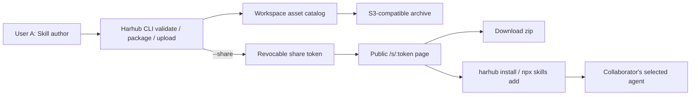

# Agent Skill 发布、分享与安装闭环

> 状态更新时间：2026-07-16。`0.1.0-beta.3` 已经具备基础 share、download 和 install 路径；本章定义这条路径的产品边界、完成标准和下一阶段补齐项。

## 目标

Harhub 的 Skills-first MVP 必须形成一个可以被真实用户完成的分发闭环：

1. 用户 A 在本地创建或维护一个标准 Agent Skill。
2. 用户 A 通过 CLI 校验并上传 Skill，同时显式创建 share。
3. Harhub 返回一个可转发的 public share page。
4. 协作者 B 无需加入 A 的 workspace，即可查看基本信息和 validation 状态。
5. B 可以下载 zip，或用一条 CLI 命令安装到选定的 agent。
6. A 可以撤销 share；Harhub 可以衡量 share 是否真正带来了 download 或 install。

这条闭环比单纯的“上传到 catalog”更重要。上传只证明 Harhub 保存了资产；分享、下载和安装才证明资产发生了复用。

## 产品承诺

一个最小成功体验应当是：

```text
Author uploads a valid Skill
  -> Harhub returns a share URL
  -> Collaborator opens the URL
  -> Collaborator downloads or installs the Skill
  -> Author can revoke access
```

Harhub 仍然不定义新的 Skill package 格式。Share、release、checksum、事件和权限都属于 Harhub runtime state，不写入或包装 `SKILL.md`。

## 产品决策

### 1. Upload 默认私有，Share 必须显式

普通 upload 只把 Skill 放入当前 workspace。用户必须通过以下任一路径显式创建 public share：

- `harhub skills upload <path> --share`
- `harhub assets upload <zip> --share`
- `harhub share <id|name|slug>`
- Skill detail 页的 **Share** action

这样可以维持 workspace tenancy，不会因为上传操作意外公开内部 Skill。

### 2. Share 是 unlisted bearer link，不是公开 marketplace

`/s/:token` 对任何持有链接的人开放，不要求 Harhub account。Token 本身就是访问凭证：

- Share page 不出现在公开索引或搜索结果中。
- Public response 不暴露 workspace catalog、S3 bucket 或 object key。
- Owner 撤销 share 或删除 asset 后，metadata、discovery 和 download 都应立即失效。
- 撤销后再次 share 应生成新的 token，旧链接不能恢复。

### 3. 分享链接最终必须固定到不可变发布快照

当前实现用 `workspaceId + assetId` 解析 share。重新上传同名 Skill 后，已有链接可能跟随 catalog 中的新对象变化。这足以验证基础 UX，但不满足可复现发布。

目标模型中，每次成功 upload 都生成不可变 `AssetRelease`。Share 应引用 release，而不是可变 logical asset：

```text
Asset
  -> AssetRelease 1 -> Share A
  -> AssetRelease 2 -> Share B
```

旧链接必须继续下载旧 release，除非 owner 主动撤销。第一版不强制用户提供 semantic version；内部 release id、上传时间和 checksum 已足以保证可复现性。

### 4. 安装必须消费标准 Skill 包

Share page 提供两条兼容路径：

- `harhub install <share-url>`
- `npx skills add <share-url>`

Harhub 的 discovery endpoint 遵循 [Agent Skills discovery RFC v0.2.0](https://github.com/cloudflare/agent-skills-discovery-rfc)，并为 archive 提供 SHA-256 digest。Skill 本身继续遵循 [Agent Skills specification](https://agentskills.io/specification)。Harhub 只接受 `SKILL.md` 位于 archive 根目录的标准包；Harhub CLI 下载并校验 archive，再将实际 agent 目标选择和文件安装交给 Agent Skills CLI。Harhub 不修改 Skill 内容，也不执行包内脚本。

## 当前用户流程

### 发布者

```bash
harhub login
harhub skills upload ./skills/code-review --share
```

CLI 在 upload 成功后输出：

```text
Uploaded code-review from ./skills/code-review
Share: https://harhub.example.com/s/<token>
```

已上传的 Skill 也可以单独 share：

```bash
harhub share code-review
```

该命令输出 share page、Harhub CLI install command 和 Agent Skills CLI install command。

### 协作者

协作者打开：

```text
https://harhub.example.com/s/<token>
```

当前 public page 展示：

- Skill name、display name 和 description。
- Validation health 和 error count。
- Harhub CLI install command。
- Agent Skills CLI install command。
- Direct zip download。

协作者可以执行：

```bash
harhub install https://harhub.example.com/s/<token>
```

交互模式下由 Agent Skills CLI 选择安装目标；自动化场景可以传递 target-related flags：

```bash
harhub install <share-url> --agent codex --global --yes
harhub install <share-url> --agent claude-code,cursor --copy --yes
```

### 发布者撤销

```bash
harhub unshare code-review
```

撤销后，public page、discovery index 和 download endpoint 都返回 unavailable。删除 asset 也必须清理对应 share。

## 当前系统路径



## 当前 API

Workspace 内的 share mutation 继续保持 tenant scope：

```text
GET    /api/workspaces/:workspaceId/assets/:query/share
POST   /api/workspaces/:workspaceId/assets/:query/share
DELETE /api/workspaces/:workspaceId/assets/:query/share
```

Public token 提供 metadata、archive 和 Agent Skills discovery：

```text
GET /api/public/shares/:token
GET /api/public/shares/:token/download
GET /s/:token/.well-known/agent-skills/index.json
```

Public routes 是 workspace tenancy 的有意例外：read access 由不可猜测且可撤销的 share token 授予；所有 create/revoke mutation 仍必须通过 workspace-scoped authenticated route。

## Runtime 数据模型

### 当前 Share 记录

```text
AssetShareRecord
  token
  workspaceId
  assetId
  createdByAccountId
  createdAt
```

这能完成 unlisted share 和 revoke，但不能固定发布内容，也不能保存分发历史。

### 闭环完成所需记录

```text
AssetRelease
  id
  workspaceId
  assetId
  storageReference
  checksum
  metadataSnapshot
  validationSnapshot
  createdByAccountId
  createdAt

AssetShare
  token
  releaseId
  createdByAccountId
  createdAt
  revokedAt
  expiresAt?

DistributionEvent
  id
  releaseId
  shareTokenId
  kind
  targetAgent?
  occurredAt
```

这些都是 Harhub 产品数据，不能进入 `SKILL.md` frontmatter。

## 安全与完整性

- Object storage 默认保持私有，public download 通过 Harhub route 读取。
- Share page 和 API 不返回 storage implementation details。
- Archive 在 upload 和 download/install 时都要执行路径安全与结构校验。
- Discovery index 的 digest 必须对应实际返回 archive 的 SHA-256。
- CLI 解压时必须阻止 absolute paths、`..`、symlinks 和目标目录逃逸。
- Harhub 不自动执行 Skill 中的 scripts。
- Public metadata 和 download endpoints 需要 rate limiting、download size limits 和 abuse monitoring。
- Share mutation 最终应要求 owner/admin 或独立 publisher role；当前只要求 workspace membership 的行为仍需收紧。

## 事件与指标

闭环应追踪以下最小事件：

```text
skill_uploaded
share_created
share_page_viewed
install_command_copied
skill_downloaded
skill_install_started
skill_install_succeeded
skill_install_failed
share_revoked
```

初期北极星可以定义为 **Distributed Skill Release**：一个 uploaded release 在 7 天内由 share link 产生至少一次成功 download 或 install。

事件不得记录 Skill 内容、share token 明文、下载文件或本地安装路径。匿名协作者只需要生成短期、不可反查身份的去重标识。

## P0 完成标准

这条闭环满足以下条件时，才算完成：

1. A 能用一次 CLI upload 得到 share URL。
2. 未登录的 B 能打开 share page，看到正确 metadata 和 validation 状态。
3. B 能下载与 share 对应的 archive，并验证 checksum。
4. B 能用一条命令将 Skill 安装到选定 agent。
5. Share 固定到不可变 release；后续 upload 不会悄悄改变旧链接内容。
6. A 撤销后，page、discovery 和 download 同时失效。
7. Harhub 能统计 share view、download 和 install success，形成 activation funnel。
8. Public endpoints 具备基础 rate limit，share mutation 具备明确角色限制。

## 当前完成度

已经完成：

- CLI device login 和 workspace 选择。
- Local scan、validation、package 和 `upload --share`。
- 已上传 Asset 的 share/unshare。
- Revocable `/s/:token` public page。
- Public metadata 和 zip download。
- Agent Skills discovery index 和 archive digest。
- `harhub install` 和 `npx skills add` 安装路径。

仍需补齐：

- Immutable `AssetRelease` 和 version history。
- Share-to-release pinning。
- Distribution events 和 activation reporting。
- Public endpoint rate limiting 与 abuse controls。
- Share mutation 的 publisher role enforcement。
- 可选 expiry、download limits 和审计记录。
