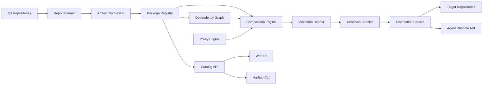

# Architecture

## Overview

Harhub is a control plane for agent harnesses. It indexes source artifacts from Git, normalizes them into a common model, versions them as packages, composes packages into bundles, validates the result, and distributes bundles to repositories and agent runtimes.

The system should separate source ownership from harness distribution:

- **Source of truth**: Git repositories, package manifests, and reviewed changes.
- **Control plane**: catalog, dependency graph, policy, validation, composition, and rollout.
- **Consumers**: repositories, agents, CLIs, IDEs, CI systems, and platform dashboards.

## High-Level Architecture



## Core Services

### Repository Scanner

Responsibilities:

- Connect to Git providers or local repositories.
- Find known harness files and package manifests.
- Track commit, branch, path, author, and review provenance.
- Detect file moves, deletions, and drift.

Scanner inputs:

- Repository allowlists.
- File discovery patterns.
- Branch policies.
- Manifest locations.

Scanner outputs:

- Raw artifact records.
- Candidate package suggestions.
- Drift findings.

### Artifact Normalizer

Responsibilities:

- Convert heterogeneous files into a typed internal model.
- Extract metadata from manifests, front matter, headings, and file paths.
- Classify artifacts as rules, skills, MCP definitions, templates, or validation assets.
- Compute content fingerprints and semantic similarity signals.

The normalizer should preserve original content and avoid lossy transformations. Normalized data supports search, comparison, and composition, but the source file remains authoritative.

### Package Registry

Responsibilities:

- Store package metadata and immutable released versions.
- Store artifact metadata and references to source content.
- Track lifecycle states: experimental, stable, deprecated, archived.
- Track owners, reviewers, consumers, and compatibility.

The registry is not just blob storage. It understands harness-specific package metadata and release state.

### Catalog API

Responsibilities:

- Search packages and artifacts.
- Serve package details, docs, dependencies, validation reports, and usage.
- Provide recommendations based on repo characteristics and org policy.
- Expose data to UI, CLI, and automation.

### Dependency Graph

Responsibilities:

- Model package dependencies and consumers.
- Show which repos, teams, bundles, and profiles depend on each package version.
- Support impact analysis before upgrades or deprecations.
- Detect cycles and incompatible version constraints.

### Composition Engine

Responsibilities:

- Resolve package version constraints.
- Apply package layers and precedence.
- Merge compatible artifacts.
- Detect conflicts, duplicates, missing dependencies, and policy violations.
- Emit resolved bundles and lockfiles.

Composition should produce an explanation trace so users can see why each artifact appears in the final bundle.

### Policy Engine

Responsibilities:

- Enforce review requirements.
- Classify MCP servers and skills by risk.
- Enforce allowed and denied tool scopes.
- Manage exceptions with expiry and owner.
- Prevent forbidden content such as secrets.

The policy engine should run at package publish time, composition time, and distribution time.

### Validation Runner

Responsibilities:

- Validate package structure and manifests.
- Validate MCP definitions and required environment variables.
- Run static policy checks.
- Run composition checks.
- Run optional agent behavior evaluations.

Validation reports should be stored with package versions and bundle resolutions.

### Distribution Service

Responsibilities:

- Materialize generated files into repositories.
- Open pull requests for harness upgrades.
- Serve runtime bundle API requests.
- Publish lockfiles.
- Report distribution status and errors.

Distribution should support reference mode, materialized mode, and hybrid mode.

## Data Model

### HarnessPackage

A named, owned, versioned unit of reusable harness content.

Fields:

- `id`
- `name`
- `owner`
- `description`
- `tags`
- `lifecycleState`
- `createdAt`
- `updatedAt`

### PackageVersion

An immutable released version of a package.

Fields:

- `id`
- `packageId`
- `version`
- `sourceRepo`
- `sourceCommit`
- `manifestPath`
- `releaseNotes`
- `validationStatus`
- `createdAt`

### Artifact

A typed item inside a package version.

Fields:

- `id`
- `packageVersionId`
- `type`
- `path`
- `contentHash`
- `sourceUri`
- `mergeStrategy`
- `risk`
- `metadata`

Artifact types:

- `rule`
- `skill`
- `mcp`
- `template`
- `validation`
- `runtime-config`

### Bundle

A resolved composition target.

Fields:

- `id`
- `targetType`
- `targetRef`
- `profile`
- `createdBy`
- `createdAt`

Target types:

- `organization`
- `team`
- `repository`
- `workflow`
- `agent`

### BundleResolution

An immutable resolved bundle output.

Fields:

- `id`
- `bundleId`
- `lockHash`
- `inputPackages`
- `resolvedArtifacts`
- `conflictDecisions`
- `policyExceptions`
- `validationStatus`
- `createdAt`

### Assignment

Connects a bundle to a consumer.

Fields:

- `id`
- `bundleId`
- `consumerType`
- `consumerRef`
- `mode`
- `status`
- `lastSyncedAt`

### Finding

A detected issue or recommendation.

Fields:

- `id`
- `kind`
- `severity`
- `targetType`
- `targetRef`
- `message`
- `evidence`
- `status`
- `createdAt`

Finding kinds:

- `duplicate`
- `conflict`
- `policy-violation`
- `drift`
- `deprecated-dependency`
- `validation-failure`
- `missing-owner`

## Composition Algorithm

Default composition flow:

1. Load target profile and assigned packages.
2. Resolve version constraints into exact package versions.
3. Expand dependencies.
4. Sort packages by layer and precedence.
5. Normalize artifacts into merge groups.
6. Detect duplicates and semantic similarity.
7. Apply merge strategies.
8. Detect conflicts and unresolved decisions.
9. Run policy checks.
10. Emit resolved bundle and lockfile.
11. Run validation.

Merge strategies should be artifact-type aware.

Rule merge strategies:

- `append-section`: append content under package-labelled sections.
- `replace-section`: replace a named section from a lower-precedence package.
- `require-explicit-choice`: fail composition until a maintainer chooses.
- `non-mergeable`: only one artifact can win.

Skill merge strategies:

- `include`: include skill as independent capability.
- `alias`: mark as equivalent to another skill.
- `supersede`: replace a lower-precedence skill.

MCP merge strategies:

- `union-tools`: combine allowed tools where policy permits.
- `restrictive-intersection`: keep only tools allowed by all applicable policies.
- `non-mergeable`: require explicit approval.

## Lockfile

A resolved bundle should produce a lockfile so consumers can reproduce the exact harness.

Example:

```yaml
apiVersion: harhub.io/v1
kind: HarnessLock
metadata:
  target: repo:payments/web-checkout
  profile: frontend-react
spec:
  resolvedAt: 2026-06-28T00:00:00Z
  lockHash: sha256:example
  packages:
    - name: org-security-baseline
      version: 1.2.3
      sourceCommit: abc123
    - name: frontend-react-standard
      version: 1.0.0
      sourceCommit: def456
  outputs:
    - path: AGENTS.md
      contentHash: sha256:agents
    - path: DESIGN.md
      contentHash: sha256:design
  policy:
    exceptions: []
```

## Storage

Recommended initial storage:

- Relational database for packages, versions, assignments, findings, audit events, and policy state.
- Object storage or Git-backed blob references for artifact content snapshots.
- Search index for catalog queries and semantic artifact discovery.
- Graph representation for dependencies and consumers. This can begin in the relational database and later move to a graph-optimized store if needed.

## API Surfaces

### Web API

Used by the UI and integrations.

Core resources:

- `/packages`
- `/packages/{name}/versions`
- `/artifacts`
- `/bundles`
- `/bundles/{id}/resolve`
- `/repositories/{id}/harness`
- `/findings`
- `/policies`

### CLI

Expected commands:

```text
harhub scan
harhub package validate
harhub package publish
harhub bundle resolve
harhub bundle diff
harhub sync
harhub findings
```

### Runtime API

Used by agents or local wrappers.

Capabilities:

- Fetch resolved bundle by repo, profile, or lock hash.
- Fetch materialized files.
- Fetch allowed MCP tool config.
- Report harness usage and validation outcomes.

## Security Architecture

Security requirements:

- Harness packages must not contain secrets.
- MCP definitions must declare required environment variables without storing values.
- MCP tools should have risk labels and allowed scopes.
- High-risk permissions require review.
- Every release, approval, assignment, and distribution event should be auditable.
- Runtime bundle retrieval should be authorized by org, team, repo, and agent identity.
- Policy exceptions should have owner, reason, and expiry.

## Deployment Model

MVP deployment can be a single service with background workers:

- Web/API service.
- Worker process for scanning, validation, composition, and distribution.
- Database.
- Object store or content snapshot store.
- Search index.

This can later split into independent services if scale requires it.

## Integration Points

Initial integrations:

- GitHub or Git provider API for scanning, commits, and pull requests.
- CI systems for validation checks.
- Agent CLIs and IDE extensions through lockfiles and runtime API.
- MCP server catalogs and internal security tooling.
- SSO/RBAC provider for enterprise deployments.

